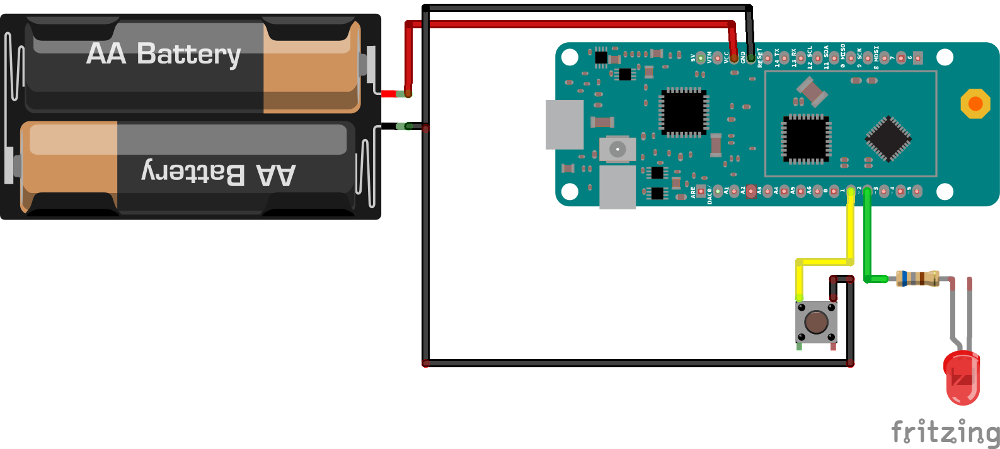

# Ouiv_Deep_Sleep

Two codes that run on an arduino MRFOX 1200 with a Cortex M0. They execute an operating routine and then go to sleep until the user push a button to wake it up.

Video example : [10 blinks and deep sleep with interruption - example](https://youtu.be/4hDMrkHKJ5g)

The schematic : 

## DeepSleep_ZeroPowerConsumption

This code is a test of the library [ZeroPowerManager](https://github.com/ee-quipment/ZeroPowerManager)

This one claim to archieve 6 uA sleep current tested on the Feather M0 board family. It also enable to control the clock frequecy.

Measured Adafruit Feather M0 WiFi with:

- LiPo removed, LDO removed
- Powered from separate 3.3V supply
- All ports + spi disabled
- USB off

48 MHz: 7.5 mA 
8 MHz: 1.5 mA 
32 KHz: 200 uA 
Sleep : 6 uA

⚠️ I couldn't get the attach interrupt to work with this code

## DeepSleep_dummy_handler

With this code, I've archieved 50μA of power consumption according to the above schematic. The 2AA power supply deliver around 3.3v voltage. 

⚠️  Don't know the real effect of it but I removed the pin initialization in "wiring.c", a core lirbary of samd21 (according to this [forum issue](https://forum.arduino.cc/t/lowest-consumption-issue/479483/17)).

Find "wiring.c" on macos :
- Open terminal
- type : `cd  ~/Library/Arduino15/packages`
- type : `open .` to open finder here and find wiring.c (generally it's on "hardware/samd/_version_/cores/arduino")

